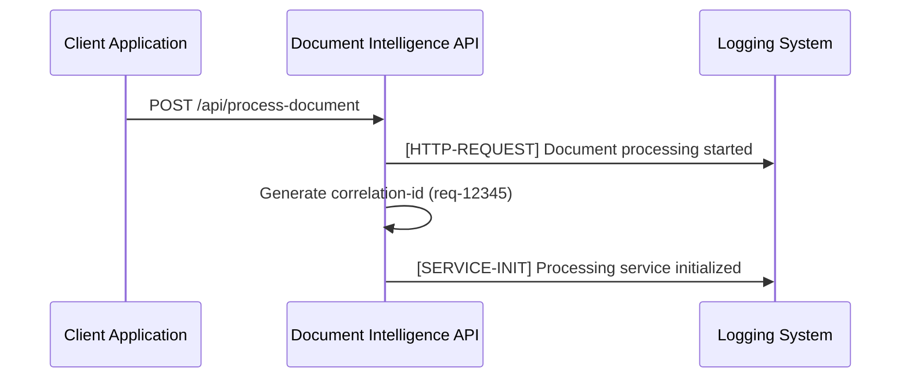
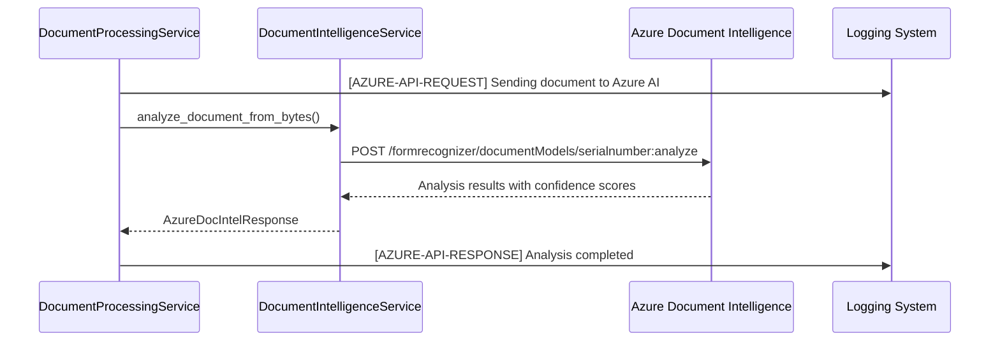
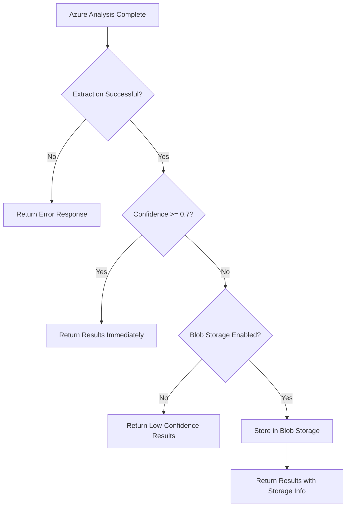
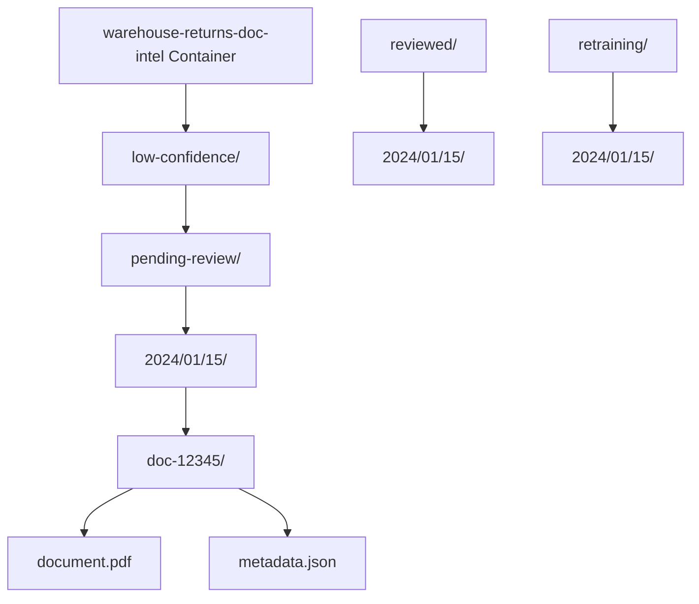

# Complete Process Flow - End-to-End Documentation

## 📋 Overview
This document explains the complete end-to-end process flow of the Warehouse Returns system, showing how all components work together to process warehouse return documents, extract serial numbers, and manage low-confidence documents for continuous improvement.

## 🎯 Business Process Overview

### **What the System Does**
The Warehouse Returns system automates the processing of warehouse return documents to extract serial numbers using AI-powered document analysis. When documents have low confidence scores, they are automatically stored for manual review and model retraining, creating a continuous improvement loop.

### **Key Business Value**
- **Automation**: Reduces manual data entry for return processing
- **Quality Assurance**: Ensures accurate serial number extraction
- **Continuous Improvement**: Builds dataset for model enhancement
- **Operational Efficiency**: Streamlines return workflows

## 🔄 Complete Process Flow

### **Phase 1: Document Submission**

#### **1.1 Client Request Initiation**


**What Happens**:
- Client submits document via HTTP POST request
- System generates unique correlation ID for request tracking
- Request logging captures method, content type, size, and correlation ID
- Processing service initializes with environment configuration

**Input Formats Supported**:
1. **Form Data**: `document_content` (base64), `document_name`, `file_id`
2. **File Upload**: Multipart form data with binary file
3. **URL Reference**: JSON body with `document_url`

**Example Request**:
```json
{
    "document_content": "JVBERi0xLjQKMSAwIG9iago8PAovVHlwZS...",
    "document_name": "warehouse_return_001.pdf",
    "file_id": "RET-2024-001"
}
```

#### **1.2 Request Validation & Processing**
```python
# function_app.py - process_document()
correlation_id = _generate_correlation_id()  # "req-abc123"

# Determine request type and extract document data
if 'document_content' in form_data:
    # Process base64-encoded document
    document_bytes = base64.b64decode(form_data['document_content'])
    filename = form_data.get('document_name', 'document.pdf')
    
# Validate file size, content type, data integrity
if len(document_bytes) > max_file_size:
    return ErrorResponse(ErrorCode.FILE_TOO_LARGE, ...)
```

**Validation Steps**:
- File size validation (max 50MB)
- Content type verification (PDF, JPEG, PNG, TIFF)
- Data integrity checks
- Filename sanitization
- Business rule validation

### **Phase 2: Azure Document Intelligence Analysis**

#### **2.1 Service Orchestration**


**What Happens**:
```python
# document_processing_service.py - analyze_document_from_bytes()
logger.info(
    f"[AZURE-API-REQUEST] Sending document for analysis - "
    f"Filename: {filename}, Size: {len(document_bytes)}, "
    f"Content-Type: {content_type}, Correlation-ID: {correlation_id}"
)

# Call Azure Document Intelligence service
azure_response, error = await self.doc_intel_service.analyze_document_from_bytes(
    document_bytes=document_bytes,
    request=file_request,
    filename=filename,
    content_type=content_type,
    correlation_id=correlation_id
)
```

#### **2.2 Azure AI Processing**
```python
# document_intelligence_service.py - analyze_document_from_bytes()
# Prepare document for Azure API
analyze_request = AnalyzeDocumentRequest(
    base64_source=base64.b64encode(document_bytes).decode('utf-8')
)

# Send to Azure Document Intelligence API
poller = self.client.begin_analyze_document(
    model_id=request.model_id,  # "serialnumber"
    analyze_request=analyze_request,
    api_version=self.api_version  # "2024-11-30"
)

# Wait for analysis completion (up to 300 seconds)
azure_result = poller.result()
```

**Azure AI Analysis**:
- **Model Used**: Custom "serialnumber" model trained on warehouse documents
- **Field Extraction**: Identifies and extracts "Serial" field
- **Confidence Scoring**: Provides 0.0-1.0 confidence score for extraction
- **Bounding Regions**: Geographic location of text in document
- **Text Spans**: Character-level position information

**Sample Azure Response**:
```json
{
    "status": "succeeded",
    "analyzeResult": {
        "documents": [{
            "fields": {
                "Serial": {
                    "type": "string",
                    "valueString": "SN123456789",
                    "confidence": 0.665,
                    "boundingRegions": [{"pageNumber": 1, "polygon": [...]}],
                    "spans": [{"offset": 1250, "length": 11}]
                }
            }
        }]
    }
}
```

### **Phase 3: Confidence Evaluation & Decision Logic**

#### **3.1 Confidence Assessment**


**Decision Logic Implementation**:
```python
# document_processing_service.py - confidence evaluation
confidence_threshold = self.confidence_threshold  # 0.7 from environment
extracted_confidence = azure_response.get_confidence_score("Serial")  # 0.665

logger.info(
    f"[BLOB-STORAGE-DECISION] Evaluating document storage requirements - "
    f"Extraction-Success: {extraction_success}, "
    f"Confidence: {extracted_confidence}, "
    f"Threshold: {confidence_threshold}, "
    f"Blob-Enabled: {self.enable_blob_storage}, "
    f"Analysis-ID: {analysis_id}"
)

# Decision matrix
storage_required = (
    extraction_success and 
    extracted_confidence < confidence_threshold and 
    self.enable_blob_storage
)

if storage_required:
    # Route to blob storage for manual review
    storage_info, storage_error = await self.blob_repository.store_low_confidence_document(...)
else:
    # Return results immediately  
    storage_info = None
```

#### **3.2 Storage Decision Outcomes**

**High Confidence (≥0.7)**: Immediate Processing
- Results returned directly to client
- No blob storage required
- Process completes successfully
- Confidence indicates reliable extraction

**Low Confidence (<0.7)**: Blob Storage Processing  
- Document stored for manual review
- Metadata includes analysis results
- Client receives results plus storage information
- Enables continuous model improvement

### **Phase 4: Blob Storage Management (Low Confidence Documents)**

#### **4.1 Storage Organization & Structure**


**Storage Path Generation**:
```python
# blob_storage_repository.py - store_low_confidence_document()
date_prefix = datetime.utcnow().strftime("%Y/%m/%d")  # "2024/01/15"
base_path = f"low-confidence/pending-review/{date_prefix}/{analysis_id}"

# File paths
document_blob_path = f"{base_path}/document{file_extension}"
metadata_blob_path = f"{base_path}/metadata.json"

logger.info(
    f"[BLOB-REPO-STORE] Generated storage paths - "
    f"Analysis-ID: {analysis_id}, "
    f"Document-Path: {document_blob_path}, "
    f"Metadata-Path: {metadata_blob_path}"
)
```

#### **4.2 Metadata Generation & Storage**
```python
# Complete metadata structure for stored documents
storage_metadata = {
    "analysis_id": "doc-12345",
    "original_filename": "warehouse_return_001.pdf",
    "content_type": "application/pdf",
    "file_size_bytes": 1048576,
    "stored_at": "2024-01-15T10:30:00.000Z",
    "correlation_id": "req-abc123", 
    "status": "pending_review",
    "analysis_results": {
        "serial_field": {
            "value": "SN123456789",
            "confidence": 0.665,
            "extraction_status": "low_confidence",
            "bounding_regions": [...],
            "spans": [...]
        },
        "model_used": "serialnumber",
        "api_version": "2024-11-30",
        "processing_time_ms": 1250
    },
    "storage_paths": {
        "document": "low-confidence/pending-review/2024/01/15/doc-12345/document.pdf",
        "metadata": "low-confidence/pending-review/2024/01/15/doc-12345/metadata.json"
    }
}
```

#### **4.3 Storage Upload Process**
```python
# blob_storage_repository.py - upload with retry logic
for attempt in range(1, self.max_retry_attempts + 1):  # 3 attempts
    try:
        # Upload original document
        await container_client.upload_blob(
            name=document_blob_path,
            data=document_data,
            content_type=content_type,
            metadata={
                "analysis_id": analysis_id,
                "original_filename": filename,
                "correlation_id": correlation_id
            },
            overwrite=True
        )
        
        # Upload metadata JSON
        metadata_json = json.dumps(storage_metadata, indent=2, default=str)
        await container_client.upload_blob(
            name=metadata_blob_path,
            data=metadata_json.encode('utf-8'),
            content_type='application/json',
            overwrite=True
        )
        
        logger.info(
            f"[BLOB-REPO-STORE] Document stored successfully - "
            f"Analysis-ID: {analysis_id}, Attempt: {attempt}"
        )
        break
        
    except AzureError as e:
        if attempt < self.max_retry_attempts:
            delay = self.retry_delay_seconds * (2 ** (attempt - 1))  # Exponential backoff
            await asyncio.sleep(delay)
            continue
        raise  # Max retries exceeded
```

### **Phase 5: Response Generation & Client Communication**

#### **5.1 Successful Processing Response**
```python
# Complete response structure for successful processing
response = DocumentAnalysisResponse(
    analysis_id="doc-12345",
    status=AnalysisStatus.COMPLETED,
    serial_field=SerialFieldResult(
        value="SN123456789",
        confidence=0.665,
        extraction_status=FieldExtractionStatus.LOW_CONFIDENCE,
        bounding_regions=[...],
        spans=[...]
    ),
    model_used="serialnumber",
    confidence_threshold=0.7,
    processing_time_ms=1250.0,
    blob_storage_info={
        "container_name": "warehouse-returns-doc-intel",
        "document_blob_path": "low-confidence/pending-review/2024/01/15/doc-12345/document.pdf",
        "metadata_blob_path": "low-confidence/pending-review/2024/01/15/doc-12345/metadata.json",
        "storage_url": "https://vendorreturns.blob.core.windows.net/warehouse-returns-doc-intel/...",
        "stored_at": "2024-01-15T10:30:00.000Z"
    },
    correlation_id="req-abc123",
    created_at=datetime.utcnow()
)
```

#### **5.2 Client Response Examples**

**High Confidence Response** (confidence ≥ 0.7):
```json
{
    "analysis_id": "doc-12345",
    "status": "completed", 
    "serial_field": {
        "value": "SN987654321",
        "confidence": 0.92,
        "extraction_status": "success"
    },
    "model_used": "serialnumber",
    "processing_time_ms": 1100,
    "blob_storage_info": null,
    "correlation_id": "req-abc123"
}
```

**Low Confidence Response** (confidence < 0.7):
```json
{
    "analysis_id": "doc-12345", 
    "status": "completed",
    "serial_field": {
        "value": "SN123456789",
        "confidence": 0.665,
        "extraction_status": "low_confidence" 
    },
    "model_used": "serialnumber",
    "processing_time_ms": 1250,
    "blob_storage_info": {
        "container_name": "warehouse-returns-doc-intel",
        "document_blob_path": "low-confidence/pending-review/2024/01/15/doc-12345/document.pdf",
        "storage_url": "https://vendorreturns.blob.core.windows.net/...",
        "stored_at": "2024-01-15T10:30:00.000Z"
    },
    "correlation_id": "req-abc123"
}
```

## 📊 Comprehensive Logging & Monitoring

### **Request Lifecycle Logging**
```
[HTTP-REQUEST] POST /api/process-document - Method: POST, Content-Type: application/json, Correlation-ID: req-abc123
[SERVICE-INIT] Processing service initialized - Blob-Enabled: true, Confidence-Threshold: 0.7
[AZURE-API-REQUEST] Sending document for analysis - Filename: return_001.pdf, Size: 1048576
[AZURE-API-RESPONSE] Analysis completed - Confidence: 0.665, Processing-Time: 1250ms  
[BLOB-STORAGE-DECISION] Document requires storage - Confidence: 0.665 < Threshold: 0.7
[BLOB-REPO-STORE] Starting document storage - Analysis-ID: doc-12345, Container: warehouse-returns-doc-intel
[BLOB-REPO-STORE] Document stored successfully - Storage-Path: low-confidence/pending-review/2024/01/15/doc-12345/
[HTTP-RESPONSE] 200 OK - Duration: 2500ms, Response-Size: 1024, Correlation-ID: req-abc123
```

### **Business Event Tracking**
```python
# Key business events logged throughout the process
logger.log_business_event(
    event_name="document_processing_started",
    entity_type="document",
    entity_id="doc-12345", 
    correlation_id="req-abc123",
    properties={
        "file_size": 1048576,
        "content_type": "application/pdf",
        "model_id": "serialnumber"
    }
)

logger.log_business_event(
    event_name="low_confidence_document_stored",
    entity_type="document",
    entity_id="doc-12345",
    correlation_id="req-abc123", 
    properties={
        "confidence_score": 0.665,
        "confidence_threshold": 0.7,
        "storage_container": "warehouse-returns-doc-intel",
        "requires_review": True
    }
)
```

## 🔄 Continuous Improvement Workflow

### **Manual Review Process**
1. **Document Retrieval**: Operations team accesses stored documents via Azure Portal or custom tools
2. **Review & Correction**: Manual verification and correction of extracted serial numbers
3. **Status Update**: Documents moved from `pending-review` to `reviewed` folder
4. **Training Data**: Corrected documents added to model retraining dataset

### **Model Enhancement Cycle**
1. **Data Collection**: Accumulate reviewed documents with corrections
2. **Model Retraining**: Periodic retraining of Azure Document Intelligence model
3. **Performance Validation**: Test new model against validation dataset
4. **Deployment**: Update model ID in environment configuration
5. **Monitoring**: Track improved confidence scores and reduced storage requirements

### **Performance Metrics & KPIs**
- **Processing Success Rate**: Percentage of documents processed successfully
- **Confidence Distribution**: Distribution of confidence scores across processed documents
- **Storage Rate**: Percentage of documents requiring manual review
- **Model Accuracy**: Accuracy improvements from retraining cycles
- **Processing Time**: Average document processing duration
- **Error Rates**: Categorized error analysis and resolution

This complete process flow demonstrates how the Warehouse Returns system provides automated document processing with intelligent quality assessment, comprehensive logging, and continuous improvement capabilities to deliver reliable serial number extraction for warehouse operations.