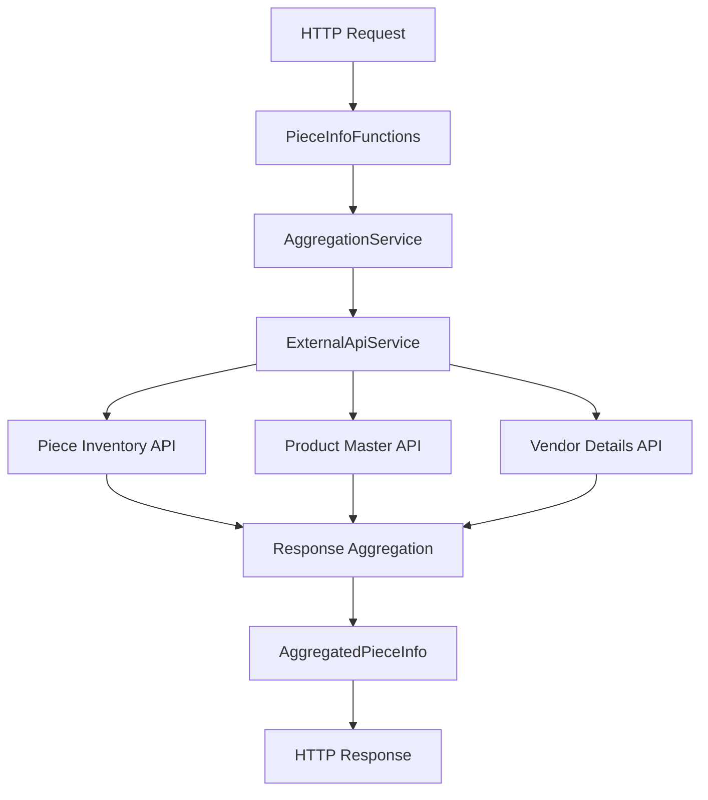

# PieceInfo API - C# Azure Functions

## 📖 **Overview**

The **PieceInfo API** is a **production-ready, enterprise-grade Azure Functions application** built with **.NET 8** that aggregates comprehensive warehouse piece information from multiple external APIs. It provides a unified endpoint to retrieve complete piece details by intelligently combining data from inventory systems, product master databases, and vendor management platforms.

### **🎯 Key Value Proposition**
- **Single Source of Truth**: One API call retrieves complete piece information from 3+ external systems
- **Production Ready**: Enterprise-grade logging, monitoring, health checks, and error handling
- **High Performance**: Async operations, connection pooling, and optimized data aggregation
- **Comprehensive Documentation**: OpenAPI/Swagger specification with interactive testing UI
- **Operational Excellence**: Structured logging, Application Insights integration, and correlation tracking

## 🏗️ **Architecture**

### **Application Structure**
```
PieceInfoApi/
├── 📂 Functions/                    # Azure Functions HTTP endpoints
│   └── PieceInfoFunctions.cs        # Main API endpoints (GetPieceInfo, Health, Swagger)
├── 📂 Models/                       # Data models and DTOs
│   ├── AggregatedPieceInfo.cs       # Main response model
│   ├── ErrorResponse.cs             # Error response structure
│   ├── ExternalApiModels.cs         # External API response models
│   └── HealthStatus.cs              # Health check model
├── 📂 Services/                     # Business logic layer
│   ├── IAggregationService.cs       # Aggregation service interface
│   ├── AggregationService.cs        # Main business logic implementation
│   ├── IExternalApiService.cs       # External API interface
│   ├── ExternalApiService.cs        # HTTP client for external APIs
│   ├── IHealthCheckService.cs       # Health check interface
│   └── HealthCheckService.cs        # Health monitoring implementation
├── 📂 Configuration/                # Configuration and settings
│   └── PieceInfoApiSettings.cs      # Application settings model
├── 📄 Program.cs                    # Application startup and DI configuration
├── 📄 host.json                     # Azure Functions runtime configuration
└── 📄 local.settings.json           # Local development settings
```

### **Data Flow Architecture**


## 🚀 **Features**

### **Core Functionality**
- ✅ **Multi-API Aggregation**: Combines data from 3 external APIs into unified response
- ✅ **Azure Functions V4**: Modern serverless architecture with .NET 8
- ✅ **OpenAPI Documentation**: Swagger/OpenAPI 3.0 specification with interactive UI
- ✅ **Health Monitoring**: Comprehensive health checks for external dependencies
- ✅ **Structured Logging**: Serilog with Application Insights integration
- ✅ **Error Handling**: Comprehensive error responses with correlation tracking

### **Enterprise Features**
- 🔒 **Security**: HTTPS/TLS support with configurable SSL verification
- 📊 **Monitoring**: Application Insights telemetry and performance tracking
- 🔄 **Resilience**: HTTP client retry policies and timeout handling
- ⚙️ **Configuration**: Environment-based configuration management
- 🏥 **Health Checks**: Dependency health validation and reporting

## 📋 **API Endpoints**

### **Main Endpoints**

| Endpoint | Method | Description | Response |
|----------|--------|-------------|----------|
| `/api/pieces/{piece_number}` | GET | Get aggregated piece information | `AggregatedPieceInfo` |
| `/api/pieces/health` | GET | Health check with dependencies | `HealthStatus` |
| `/api/swagger` | GET | OpenAPI documentation JSON | Swagger spec |
| `/api/docs` | GET | Interactive Swagger UI | HTML page |

### **Example Request/Response**

#### **Get Piece Information**
```http
GET /api/pieces/170080637
Accept: application/json
```

```json
{
  "piece_inventory_key": "170080637",
  "sku": "67007500",
  "vendor_code": "VIZIA",
  "warehouse_location": "WHKCTY",
  "rack_location": "R03-019-03",
  "serial_number": "SZVOU5GB1600294",
  "family": "ELECTRONICS",
  "description": "ALL-IN-ONE SOUNDBAR",
  "model_no": "V-SB2921-C6",
  "brand": "VIZIO",
  "category": "AUDIO",
  "group": "SOUNDBARS",
  "vendor_name": "NIGHT & DAY",
  "vendor_address": {
    "address_line1": "3901 N KINGSHIGHWAY BLVD",
    "city": "SAINT LOUIS",
    "state": "MO",
    "zip_code": "63115"
  },
  "vendor_contact": {
    "rep_name": "John Nicholson",
    "primary_rep_email": "jpnick@kc.rr.com"
  },
  "vendor_policies": {
    "serial_number_required": false,
    "vendor_return": false
  },
  "metadata": {
    "correlation_id": "abc-123-def",
    "timestamp": "2025-11-19T15:30:00.000Z",
    "version": "1.0.0",
    "source": "pieceinfo-api"
  }
}
```

#### **Health Check**
```http
GET /api/pieces/health
```

```json
{
  "status": "healthy",
  "timestamp": "2025-11-19T15:30:00.000Z",
  "dependencies": {
    "external_api": "healthy",
    "system": "healthy"
  }
}
```

## ⚙️ **Configuration**

### **Environment Variables**

| Variable | Description | Default | Required |
|----------|-------------|---------|----------|
| `EXTERNAL_API_BASE_URL` | Base URL for external APIs | `https://apim-dev.nfm.com` | ✅ |
| `OCP_APIM_SUBSCRIPTION_KEY` | API Management subscription key | - | ✅ |
| `API_TIMEOUT_SECONDS` | HTTP client timeout | `30` | ❌ |
| `API_MAX_RETRIES` | Maximum retry attempts | `3` | ❌ |
| `MAX_BATCH_SIZE` | Maximum batch processing size | `10` | ❌ |
| `VERIFY_SSL` | Enable SSL certificate verification | `false` | ❌ |
| `LOG_LEVEL` | Logging level | `Information` | ❌ |
| `WAREHOUSE_RETURNS_ENV` | Environment name | `development` | ❌ |
| `APPLICATIONINSIGHTS_CONNECTION_STRING` | App Insights connection | - | ✅ |

### **Local Development Setup**

1. **Create `local.settings.json`**:
```json
{
  "IsEncrypted": false,
  "Values": {
    "AzureWebJobsStorage": "UseDevelopmentStorage=true",
    "FUNCTIONS_WORKER_RUNTIME": "dotnet-isolated",
    "EXTERNAL_API_BASE_URL": "https://apim-dev.nfm.com",
    "OCP_APIM_SUBSCRIPTION_KEY": "your-subscription-key",
    "API_TIMEOUT_SECONDS": "30",
    "API_MAX_RETRIES": "3",
    "VERIFY_SSL": "false",
    "LOG_LEVEL": "Information",
    "WAREHOUSE_RETURNS_ENV": "development"
  }
}
```

2. **Install Dependencies**:
```bash
dotnet restore
```

3. **Run Locally**:
```bash
func start --port 7074
```

## 🛠️ **Development**

### **Build and Test**
```bash
# Build the project
dotnet build

# Run unit tests
cd ../../testcsharp/PieceInfoApi
dotnet test

# Run with hot reload
func start --port 7074
```

### **Code Quality**
```bash
# Format code
dotnet format

# Run code analysis
dotnet build --verbosity normal

# Check for security vulnerabilities
dotnet list package --vulnerable
```

## 📊 **Monitoring and Logging**

### **Structured Logging**
The application uses **Serilog** with structured logging:

```csharp
Log.Information("Processing piece info request for {PieceNumber} with correlation {CorrelationId}", 
    pieceNumber, correlationId);
```

### **Application Insights Integration**
- **Telemetry**: Automatic request/response tracking
- **Performance**: Response time and throughput metrics  
- **Errors**: Exception tracking with stack traces
- **Dependencies**: External API call monitoring

### **Health Monitoring**
- **Health Endpoint**: `/api/pieces/health`
- **Dependency Checks**: External API availability
- **System Metrics**: Memory, CPU, and performance indicators

## 🚀 **Deployment**

### **Azure Functions Deployment**
```bash
# Publish to Azure
func azure functionapp publish your-function-app-name

# Deploy with Azure CLI
az functionapp deployment source config-zip \
  -g your-resource-group \
  -n your-function-app \
  --src publish.zip
```

### **Infrastructure as Code**
See `../../infrastructure/` for:
- **Bicep templates**: Azure resource definitions
- **Terraform modules**: Multi-cloud infrastructure
- **ARM templates**: Legacy Azure deployments

## 🔧 **Architecture Patterns**

### **Dependency Injection**
```csharp
// Service registration in Program.cs
services.AddSingleton<IAggregationService, AggregationService>();
services.AddHttpClient<IExternalApiService, ExternalApiService>();
```

### **Configuration Pattern**
```csharp
// Strongly-typed configuration
services.Configure<PieceInfoApiSettings>(configuration.GetSection("PieceInfoApi"));
```

### **Repository Pattern**
```csharp
// Clean separation of concerns
public interface IAggregationService
{
    Task<AggregatedPieceInfo> GetPieceInfoAsync(string pieceNumber);
}
```

## 🏥 **Error Handling**

### **Error Response Format**
```json
{
  "error": "validation_error",
  "message": "Piece number is required",
  "correlation_id": "abc-123-def",
  "details": {
    "parameter": "piece_number",
    "provided_value": null
  }
}
```

### **HTTP Status Codes**
- **200**: Success - piece information retrieved
- **400**: Bad Request - validation error
- **404**: Not Found - piece not found in external APIs
- **429**: Too Many Requests - rate limit exceeded
- **500**: Internal Server Error - system error
- **502**: Bad Gateway - external API error
- **504**: Gateway Timeout - external API timeout

## 📈 **Performance**

### **Optimization Features**
- ✅ **Async/Await**: Non-blocking I/O operations
- ✅ **HTTP Client Pooling**: Efficient connection management
- ✅ **Response Compression**: Gzip/Deflate support
- ✅ **Caching Headers**: Appropriate cache control
- ✅ **Minimal Allocations**: Record types and spans

### **Scalability**
- **Serverless**: Automatic scaling with Azure Functions
- **Stateless**: No server-side session state
- **Parallel Processing**: Concurrent external API calls
- **Connection Pooling**: Optimized HTTP client usage

## 🔒 **Security**

### **Security Features**
- 🔐 **HTTPS/TLS**: Encrypted communication
- 🔑 **API Keys**: Subscription key authentication
- 🛡️ **Input Validation**: Parameter sanitization
- 🔒 **CORS**: Cross-origin request control
- 🚫 **Rate Limiting**: Request throttling protection

### **Security Best Practices**
- No sensitive data in logs
- Correlation IDs for request tracking
- Secure configuration management
- Regular dependency updates

## 🚦 **Getting Started**

1. **Clone Repository**:
```bash
git clone https://github.com/veerayerva/warehousereturns.git
cd warehousereturns/srccsharp/PieceInfoApi
```

2. **Setup Configuration**:
```bash
cp local.settings.template.json local.settings.json
# Edit local.settings.json with your API keys
```

3. **Install Tools**:
```bash
# Install Azure Functions Core Tools
npm install -g azure-functions-core-tools@4 --unsafe-perm true

# Install .NET 8
# Download from: https://dotnet.microsoft.com/download/dotnet/8.0
```

4. **Run Application**:
```bash
dotnet build
func start --port 7074
```

5. **Test Endpoints**:
```bash
# Health check
curl http://localhost:7074/api/pieces/health

# API documentation
open http://localhost:7074/api/docs

# Get piece info
curl http://localhost:7074/api/pieces/170080637
```

## 📚 **Additional Documentation**

- **[Setup Guide](./SETUP.md)**: Detailed setup instructions
- **[API Implementation](./PIECEINFO_IMPLEMENTATION_SUMMARY.md)**: Technical implementation details
- **[Optimization Guide](./OPTIMIZATION_SUMMARY.md)**: Performance optimization strategies
- **[Test Suite](../../testcsharp/PieceInfoApi/README.md)**: Comprehensive test documentation

---

## 🏆 **Summary**

The **PieceInfo API** is a **production-ready, enterprise-grade Azure Functions application** that provides:

- 🎯 **Unified Data Access**: Single endpoint for comprehensive piece information
- 🚀 **Modern Architecture**: .NET 8, Azure Functions V4, dependency injection
- 📊 **Production Features**: Monitoring, logging, health checks, documentation
- 🔒 **Enterprise Security**: HTTPS, authentication, validation, error handling
- 🏥 **Operational Excellence**: Structured logging, telemetry, alerting
- 📈 **Performance**: Async operations, connection pooling, optimized serialization

Ready for **production deployment** with comprehensive documentation, testing, and monitoring capabilities!